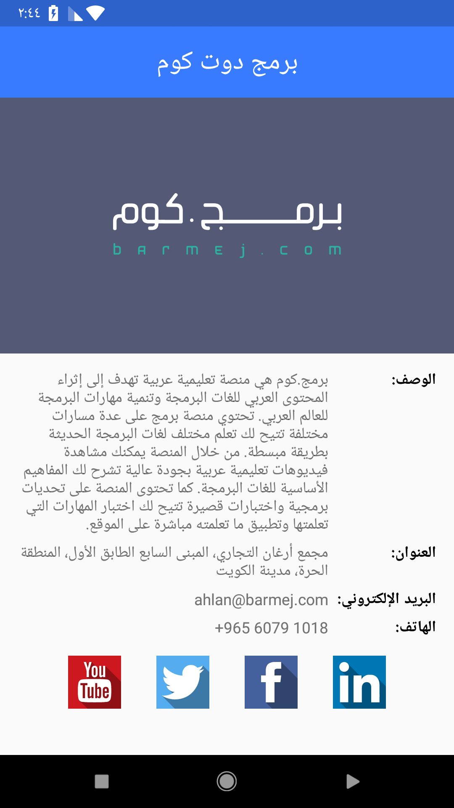

# 
بناء تطبيق بطاقة أعمال

قم بتصميم وبناء تطبيق بشاشة واحدة يعرض معلومات حول شركة أو مؤسسة في منطقتك.
يمكن أن تكون إحدى الشركات الوطنية في بلدك، يمكن أن يكون مطعم مشهور أو حتى صالة الرياضة القريبة من منزلك.

# 
متطلبات المشروع:

في الدروس الأخيرة تعلمت كيفية جلب البيانات من خلال الإنترنت بالإضافة إلى كيفية التعامل مع الـ Web APIs وتنسيقات البيانات خاصة تنسيق JSON.
في هذا المشروع سوف تتدرب على هذه المهارات حيث ستقوم بجلب بيانات الصورة من الانترنت على هيئة JSON ثم ستقوم بتحليل هذه البيانات وعرضها للمستخدم.

# 
متطلبات المشروع

يجب أن يحتوي تصميمك على البيانات التالية:
<ul>
<li>إسم الشركة/المؤسسة/النادي الخ ..</li> 
<li>وصف المؤسسة</li>
<li>على الأقل صورة واحدة تمثل المؤسسة مثل شعار المؤسسة أو صورة لموقعها أو ما إلى ذلك.</li>
<li>معلومتين أو أكثر من المعلومات الأساسية مثل البريد الإلكتروني، العنوان، الموقع الإلكتروني، رقم الهاتف أو الموبايل، ساعات العمل.</li>
</ul>

بالنسبة لأيقونات مواقع التواصل يمكنك استخدام أي أيقونات تجدها مناسبة، عن طريق البحث في الانترنت.

ملاحظة: ليس مطلوبا أن تكون البيانات حقيقية ولكن يفضل أن تقوم بعمل بطاقة معلومات لمؤسسة حقيقية كأنك تقوم ببناء تطبيق لهم.

# 
واجهات المشروع

# 
الرخصة

يمكنك الإطلاع على نسخة من الرخصة [من هنا](LICENSE)

